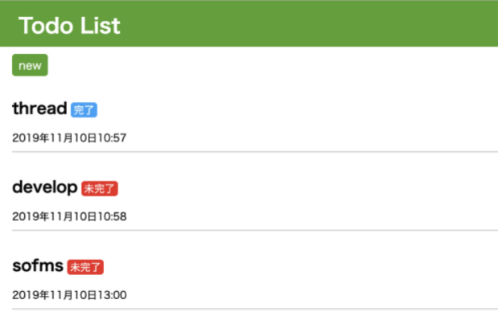

# web lecture

## overview

ゼミで行ったwebレクチャーのサンプルアプリ。

## lecture

- Dockerで開発環境を構築する
- Djangoでtodoアプリをつくる

資料は[こちら](https://drive.google.com/file/d/1zZZhLnbR0wrnhL9HqwbR4udWGvCqWdKe/view?usp=sharing)。

## features

- アイテムのCRUD
- アイテムのスイッチ(todo <-> done)

## how to start

以下のポートが空いている必要があります。
- 3306
- 8000

1. `docker-compose up -d`でコンテナの起動
2. `make initmigration`でDBのマイグレーション
3. `make createsuperuser`でスーパーユーザの作成
4. `docker-compose logs -f app`でログの確認

終了するときは`docker-compose down --rmi local --volumes`でコンテナを削除できます。
